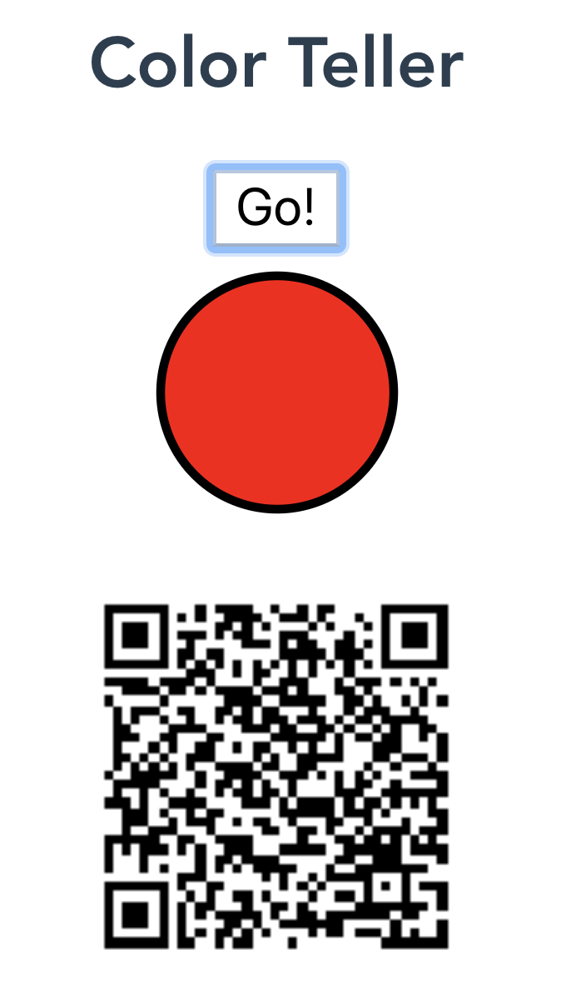
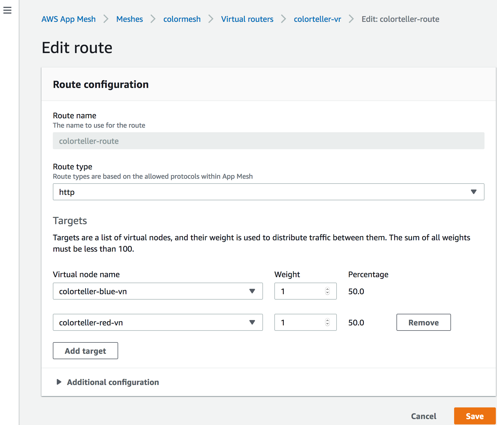
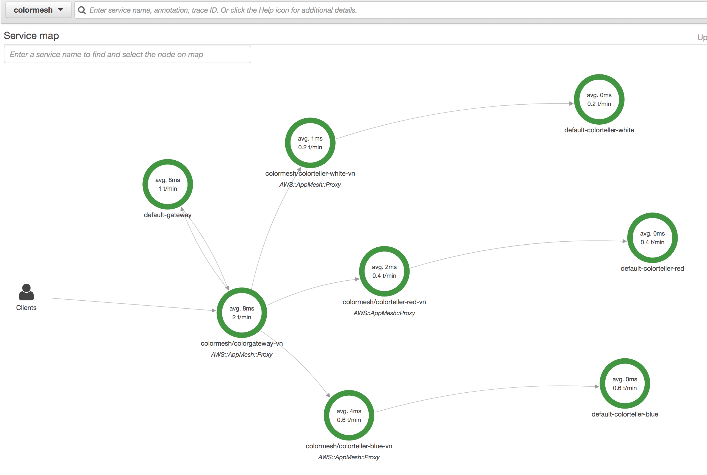

# ColorTeller - AppMesh, X-Ray + Fargate Demo using AWS CDK

This demo has been updated and tested to work with Node.js v12.16.0 and AWS CDK v1.23.

Note: colorteller, appmesh envoy Docker images are hosted on dockerhub for now.

## Quick start (in AWS Cloud9 or anywhere)

Note: depending on how you have authenticated for access to you AWS account, you may need to set environment variables ``AWS_ACCESS_KEY_ID``, ``AWS_SECRET_ACCESS_KEY``, ``AWS_SESSION_TOKEN``, ``AWS_DEFAULT_REGION`` before proceeding.
```
cd cdkcolorteller
nvm install 12.16.0
nvm alias default v12.16.0
npm i -g aws-cdk@1.23.0
npm install
npm run build
cdk bootstrap
cdk deploy
```
this will deploy AWS Fargate/AppMesh/Frontend code as container, but we need to update vuejs container with the newly create ALB endpoint.

The ALB DNS is printed at the end of cdk deploy's output. Edit ``vueapp/src/App.vue`` and on line 27 replace the text ``ALB-DNS`` with your ALB DNS.
```
vi vueapp/src/App.vue # edit line 27 and insert the correct the ALB DNS Name
npm run build
cdk deploy
```

Once fully deployed, go to the newly created ALB and access its ``/color`` endpoint multiple times. Initially the json output will always return ``blue``.
eg:
```
curl http://<ALB-DNS>/color
```

Or you can use your browser to access the newly created Vuejs frontend at:
```
http://<ALB-DNS>/app/
```
You can also open up the Chrome/Firefox Developer tool to show the network requests/responses.




## Change the routing weights to the colorteller backend
You can change the current 1:1:1 weight of colorteller routes to show appmesh traffic shaping feature.

In the AWS APp Mesh Console, navigate to Virtual Routers and edit the ``colorteller-vr``. You will see that all traffic is being routed to a single target i.e. ``colorteller-blue-vn``.

Add another target e.g. ``colorteller-red-vn`` and assign a weight of 1 so that the traffic is routed 50/50 between blue and red. Click Save.




Access the colorteller repeatedly to that traffic is now being spread equally across red and blue.

You can get the audience to participate using the QR code provided in the Vue app.

You can display the raw output to show the cumulative distribution of traffic.

## AWS X-Ray

In AWS Xray console, choose “Create group”, name the group “color”, and enter the expression that filters all the ``/color`` requests.

```
(service("colormesh/colorgateway-vn")) AND http.url ENDSWITH "/color"
```

Click on the “colormesh” group and you'll see AWS X-ray  already started collecting metrics, and drawing out a service map.




Refer to this blog post for more info:
https://medium.com/containers-on-aws/aws-app-mesh-walkthrough-deploy-the-color-app-on-amazon-ecs-de3452846e9d

